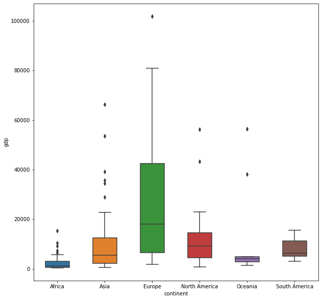

# Цель лабораторной работы
Изучение различных методов визуализация данных и создание истории на основе данных.

# Задание
Выбрать набор данных (датасет). Вы можете найти список свободно распространяемых датасетов здесь.
Для лабораторных работ не рекомендуется выбирать датасеты очень большого размера.

Создать "историю о данных" в виде юпитер-ноутбука, с учетом следующих требований:

1.История должна содержать не менее 5 шагов (где 5 - рекомендуемое количество шагов). Каждый шаг содержит график и его текстовую интерпретацию.

2.На каждом шаге наряду с удачным итоговым графиком рекомендуется в юпитер-ноутбуке оставлять результаты предварительных "неудачных" графиков.
3.Не рекомендуется повторять виды графиков, желательно создать 5 графиков различных видов.

4.Выбор графиков должен быть обоснован использованием методологии data-to-viz. Рекомендуется учитывать типичные ошибки построения выбранного вида графика по методологии data-to-viz. Если методология Вами отвергается, то просьба обосновать Ваше решение по выбору графика.

5.История должна содержать итоговые выводы. В реальных "историях о данных" именно эти выводы представляют собой основную ценность для предприятия.


Сформировать отчет и разместить его в своем репозитории на github.

# Ход выполнения работы

## Текстовое описание набора данных

Набор данных, использованный в эксперименте, взят из статистики Всемирного банка за 2015 год.

Этот набор данных состоит из одного файла WorldIndex.csv, содержащего все данные датасета. Данный файл содержит следующие колонки:

+ Country--названия стран мира  
+ Continent--континент, на котором расположена страна
+ Life_expectancy--ожидаемая продолжительность жизни	
+ GDP_per_capita--ВВП на душу населения
+ Population--население страны

# Основные характеристики набора данных
Подключим все необходимые библиотеки:


```python
import matplotlib.pyplot as plt
import pandas as pd
import numpy as np
import seaborn as sns
```

Импорт набора данных и просмотр


```python
data=pd.read_csv('WorldIndex.csv')
data.head()
```


<div>
<style scoped>
    .dataframe tbody tr th:only-of-type {
        vertical-align: middle;
    }

    .dataframe tbody tr th {
        vertical-align: top;
    }

    .dataframe thead th {
        text-align: right;
    }
</style>
<table border="1" class="dataframe">
  <thead>
    <tr style="text-align: right;">
      <th></th>
      <th>Country</th>
      <th>Continent</th>
      <th>Life_expectancy</th>
      <th>GDP_per_capita</th>
      <th>Population</th>
    </tr>
  </thead>
  <tbody>
    <tr>
      <th>0</th>
      <td>Algeria</td>
      <td>Africa</td>
      <td>75.042537</td>
      <td>4132.760292</td>
      <td>39871528.0</td>
    </tr>
    <tr>
      <th>1</th>
      <td>Angola</td>
      <td>Africa</td>
      <td>52.666098</td>
      <td>3695.793748</td>
      <td>27859305.0</td>
    </tr>
    <tr>
      <th>2</th>
      <td>Benin</td>
      <td>Africa</td>
      <td>59.720707</td>
      <td>783.947091</td>
      <td>10575952.0</td>
    </tr>
    <tr>
      <th>3</th>
      <td>Botswana</td>
      <td>Africa</td>
      <td>64.487415</td>
      <td>6532.060501</td>
      <td>2209197.0</td>
    </tr>
    <tr>
      <th>4</th>
      <td>Burundi</td>
      <td>Africa</td>
      <td>57.107049</td>
      <td>303.681022</td>
      <td>10199270.0</td>
    </tr>
  </tbody>
</table>
</div>


Проверьте соответствующую информацию набора данных


```python
data.info()
```

    <class 'pandas.core.frame.DataFrame'>
    RangeIndex: 177 entries, 0 to 176
    Data columns (total 5 columns):
     #   Column           Non-Null Count  Dtype  
    ---  ------           --------------  -----  
     0   Country          177 non-null    object 
     1   Continent        177 non-null    object 
     2   Life_expectancy  169 non-null    float64
     3   GDP_per_capita   169 non-null    float64
     4   Population       176 non-null    float64
    dtypes: float64(3), object(2)
    memory usage: 7.0+ KB
    

Простая обработка набора данных, удаление элементов с отсутствующими данными


```python
df=data.dropna()
df.info()
```

    <class 'pandas.core.frame.DataFrame'>
    Int64Index: 164 entries, 0 to 175
    Data columns (total 5 columns):
     #   Column           Non-Null Count  Dtype  
    ---  ------           --------------  -----  
     0   Country          164 non-null    object 
     1   Continent        164 non-null    object 
     2   Life_expectancy  164 non-null    float64
     3   GDP_per_capita   164 non-null    float64
     4   Population       164 non-null    float64
    dtypes: float64(3), object(2)
    memory usage: 7.7+ KB
    

Переименуйте столбцы набора данных и нарисуйте гистограмму ожидаемой продолжительности жизни в мире.


```python
df.columns = ['country', 'continent', 'life', 'gdp', 'popu']
```


```python
plt.hist(df.life,bins=30,rwidth=0.8)
plt.xlabel('average life length')
plt.ylabel('number of countries')
plt.title('world life expectancy')
plt.show()
```


    

    


Очевидно, что:  
В наибольшем числе стран ожидаемая продолжительность жизни составляет около 75 лет, за ними следуют 82 года.


```python
plt.hist(df.gdp,bins=30,rwidth=0.9,color='green')

plt.xlabel('GDP per capita (USD)')
plt.ylabel('number of countries')
plt.title('GDP per capita of the country')
plt.show()
```


    

    


Видно, что:   
Количество стран в мире с ВВП на душу населения от 1000 до 2000 долларов по-прежнему остается самым большим, но в то же время уже есть страны с ВВП на душу населения, достигающим 100 000 долларов.

Теперь давайте посмотрим на количество стран на каждом континенте и посмотрим на их долю в мире.


```python
conti_count=df.continent.value_counts()
conti_count
```


    Africa           48
    Europe           41
    Asia             36
    North America    19
    South America    11
    Oceania           9
    Name: continent, dtype: int64


```python
conti=list(conti_count.index)
conti
```


    ['Africa', 'Europe', 'Asia', 'North America', 'South America', 'Oceania']


```python
x=np.arange(len(conti))
x
```


    array([0, 1, 2, 3, 4, 5])


```python
plt.pie(conti_count,labels=conti,autopct='%1.lf%%')
plt.axis('equal')
plt.show()
```


    

    


В Африке больше всего стран в мире, за ней следует Европа, а затем Азия.

Теперь посмотрите на ожидаемую продолжительность жизни и ВВП на душу населения по континентам.


```python
plt.boxplot(df.life,notch=True,labels=conti,meanline=True)
plt.show()
```


    ---------------------------------------------------------------------------

    ValueError                                Traceback (most recent call last)

    Input In [25], in <cell line: 1>()
    ----> 1 plt.boxplot(df.life,notch=True,labels=conti,meanline=True)
          2 plt.show()
    

    File D:\python32\lib\site-packages\matplotlib\pyplot.py:2428, in boxplot(x, notch, sym, vert, whis, positions, widths, patch_artist, bootstrap, usermedians, conf_intervals, meanline, showmeans, showcaps, showbox, showfliers, boxprops, labels, flierprops, medianprops, meanprops, capprops, whiskerprops, manage_ticks, autorange, zorder, data)
       2418 @_copy_docstring_and_deprecators(Axes.boxplot)
       2419 def boxplot(
       2420         x, notch=None, sym=None, vert=None, whis=None,
       (...)
       2426         whiskerprops=None, manage_ticks=True, autorange=False,
       2427         zorder=None, *, data=None):
    -> 2428     return gca().boxplot(
       2429         x, notch=notch, sym=sym, vert=vert, whis=whis,
       2430         positions=positions, widths=widths, patch_artist=patch_artist,
       2431         bootstrap=bootstrap, usermedians=usermedians,
       2432         conf_intervals=conf_intervals, meanline=meanline,
       2433         showmeans=showmeans, showcaps=showcaps, showbox=showbox,
       2434         showfliers=showfliers, boxprops=boxprops, labels=labels,
       2435         flierprops=flierprops, medianprops=medianprops,
       2436         meanprops=meanprops, capprops=capprops,
       2437         whiskerprops=whiskerprops, manage_ticks=manage_ticks,
       2438         autorange=autorange, zorder=zorder,
       2439         **({"data": data} if data is not None else {}))
    

    File D:\python32\lib\site-packages\matplotlib\__init__.py:1412, in _preprocess_data.<locals>.inner(ax, data, *args, **kwargs)
       1409 @functools.wraps(func)
       1410 def inner(ax, *args, data=None, **kwargs):
       1411     if data is None:
    -> 1412         return func(ax, *map(sanitize_sequence, args), **kwargs)
       1414     bound = new_sig.bind(ax, *args, **kwargs)
       1415     auto_label = (bound.arguments.get(label_namer)
       1416                   or bound.kwargs.get(label_namer))
    

    File D:\python32\lib\site-packages\matplotlib\axes\_axes.py:3711, in Axes.boxplot(self, x, notch, sym, vert, whis, positions, widths, patch_artist, bootstrap, usermedians, conf_intervals, meanline, showmeans, showcaps, showbox, showfliers, boxprops, labels, flierprops, medianprops, meanprops, capprops, whiskerprops, manage_ticks, autorange, zorder)
       3708 if bootstrap is None:
       3709     bootstrap = rcParams['boxplot.bootstrap']
    -> 3711 bxpstats = cbook.boxplot_stats(x, whis=whis, bootstrap=bootstrap,
       3712                                labels=labels, autorange=autorange)
       3713 if notch is None:
       3714     notch = rcParams['boxplot.notch']
    

    File D:\python32\lib\site-packages\matplotlib\cbook\__init__.py:1161, in boxplot_stats(X, whis, bootstrap, labels, autorange)
       1159     labels = itertools.repeat(None)
       1160 elif len(labels) != ncols:
    -> 1161     raise ValueError("Dimensions of labels and X must be compatible")
       1163 input_whis = whis
       1164 for ii, (x, label) in enumerate(zip(X, labels)):
       1165 
       1166     # empty dict
    

    ValueError: Dimensions of labels and X must be compatible


    

    


Начал использовать plt.boxplot для рисования коробчатых диаграмм, но обнаружил, что группировка не может быть выполнена, вам нужно сначала разделить групповые классы самостоятельно.Затем используйте seaborn, который может указать значения x, y для рисования.


```python
plt.figure(figsize=(10,10))
sns.boxplot(x='continent',y='life',data=df,width=0.5)
```


    <AxesSubplot:xlabel='continent', ylabel='life'>


    

    


```python
plt.figure(figsize=(10,10))
sns.boxplot(x='continent',y='gdp',data=df,width=0.5)
```


    <AxesSubplot:xlabel='continent', ylabel='gdp'>


    

    


Всесторонний анализ ящичковых диаграмм ВВП на душу населения и ожидаемой продолжительности жизни показывает, что в Африке самые низкие показатели ВВП на душу населения и ожидаемой продолжительности жизни, а в Европе самые высокие ВВП на душу населения и ожидаемая продолжительность жизни.

Теперь выполните корреляционный анализ набора данных и нарисуйте матричный график.


```python
pd.plotting.scatter_matrix(df)
plt.show()
```


    

    


Можно видеть, что нет корреляции между населением, ожидаемой продолжительностью жизни и ВВП на душу населения, в то время как ожидаемая продолжительность жизни и ВВП имеют положительную корреляцию, и для них построены графики рассеяния.


```python
plt.scatter(df.gdp,df.life)
plt.title('The relationship between health and economic levels across countries (2015)')
plt.xlabel('GDP per capita (USD)')
plt.ylabel('average life length')
plt.show()
```


    

    


Логарифмически преобразуйте горизонтальную ось диаграммы рассеяния и сделайте размер точек данных пропорциональным численности населения, добавив разные цвета для разных континентов, чтобы получить обработанную диаграмму рассеяния ниже.


```python
map_dict = {      
    'Asia':'red',
    'Europe':'green',
    'Africa':'blue',
    'North America':'yellow',
    'South America':'yellow',
    'Oceania':'black'
}
colors = df.continent.map(map_dict)   

size = df.popu / 1e6 * 2
plt.scatter(x=df.gdp, y=df.life, s=size, c=colors, alpha=0.5)  
plt.xscale('log')

plt.xlabel('GDP per capita (USD)')
plt.ylabel('average life length(Year)')
plt.title('The relationship between global health and income levels (2015)')

tick_val = [1000,10000,100000]
tick_lab = ['1k','10k','100k']
plt.xticks(tick_val, tick_lab)
plt.show()
```


    

    


Видно, что в Азии проживает подавляющее большинство населения мира, и ВВП на душу населения также находится на среднем уровне. Африка занимает второе место в мире по численности населения, но ее ВВП на душу населения является самым низким в мире. Судя по предыдущей круговой диаграмме с номерами стран, можно сделать вывод, что слишком много стран могут повлиять на развитие всей Африки. Если есть другие наборы данных, их можно изучить более подробно. Европа и Америка являются местом сбора развитых стран мира.Предполагается, что малочисленность населения и высокий уровень ВВП на душу населения значительно улучшают качество жизни людей и влияют на продолжительность жизни. 


```python

```
